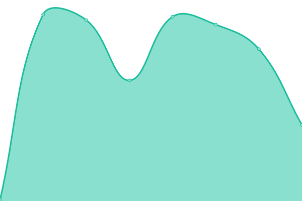
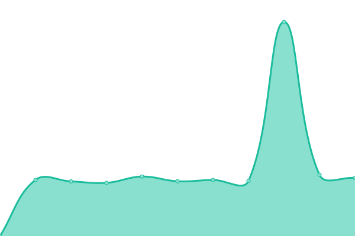
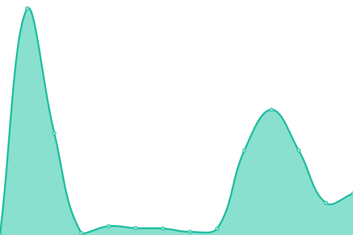
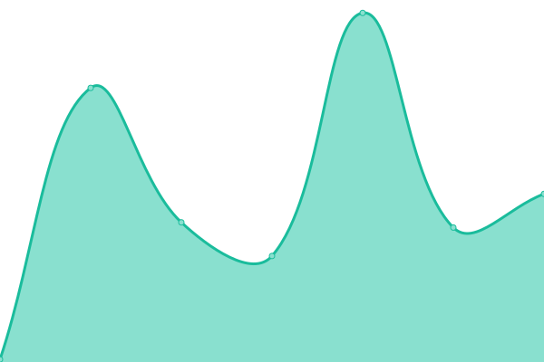
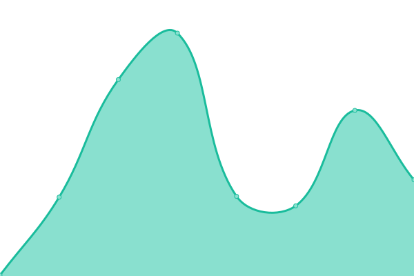
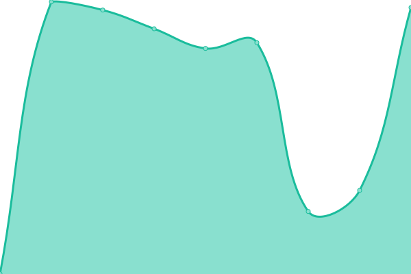
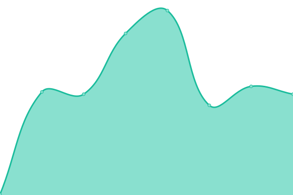
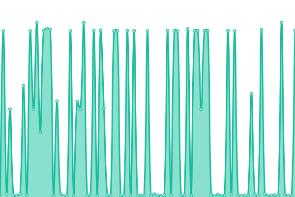

# [📈 Live Status](https://demo.upptime.js.org): <!--live status--> **🟧 Partial outage**

This repository contains the open-source uptime monitor and status page for [Victor Emanuel Cuello](https://emacuello.link), powered by [Upptime](https://github.com/upptime/upptime).

With [Upptime](https://upptime.js.org), you can get your own unlimited and free uptime monitor and status page, powered entirely by a GitHub repository. We use [Issues](https://github.com/emacuello/upptime/issues) as incident reports, [Actions](https://github.com/emacuello/upptime/actions) as uptime monitors, and [Pages](https://demo.upptime.js.org) for the status page.

<!--start: status pages-->
<!-- This summary is generated by Upptime (https://github.com/upptime/upptime) -->
<!-- Do not edit this manually, your changes will be overwritten -->
<!-- prettier-ignore -->
| URL | Status | Historial | Tiempo de respuesta | Uptime |
| --- | ------ | ------- | ------------- | ------ |
|  [Youdrive](https://youdrive.vercel.app/) | 🟩 Up | [youdrive.yml](https://github.com/emacuello/upptime/commits/HEAD/history/youdrive.yml) | 

 104ms
     
 | 

<a href="https://emacuello.github.io/upptime/history/youdrive">100.00%</a>
    

|  [Emax-Peluquería](https://emaxpeluqueria.vercel.app/) | 🟩 Up | [emax-peluqueria.yml](https://github.com/emacuello/upptime/commits/HEAD/history/emax-peluqueria.yml) | 

 100ms
     
 | 

<a href="https://emacuello.github.io/upptime/history/emax-peluqueria">100.00%</a>
    

|  Emacommerce API | 🟩 Up | [emacommerce-api.yml](https://github.com/emacuello/upptime/commits/HEAD/history/emacommerce-api.yml) | 

 2609ms
     
 | 

<a href="https://emacuello.github.io/upptime/history/emacommerce-api">100.00%</a>
    

|  Youdrive API | 🟥 Down | [youdrive-api.yml](https://github.com/emacuello/upptime/commits/HEAD/history/youdrive-api.yml) | 

 0ms
     
 | 

<a href="https://emacuello.github.io/upptime/history/youdrive-api">0.00%</a>
    

|  Emax-Peluquería API GATEWAY | 🟩 Up | [emax-peluqueria-api-gateway.yml](https://github.com/emacuello/upptime/commits/HEAD/history/emax-peluqueria-api-gateway.yml) | 

 1354ms
     
 | 

<a href="https://emacuello.github.io/upptime/history/emax-peluqueria-api-gateway">100.00%</a>
    

|  Emax-Peluquería API Microservices | 🟩 Up | [emax-peluqueria-api-microservices.yml](https://github.com/emacuello/upptime/commits/HEAD/history/emax-peluqueria-api-microservices.yml) | 

 84ms
     
 | 

<a href="https://emacuello.github.io/upptime/history/emax-peluqueria-api-microservices">100.00%</a>
    

|  Contact Form API | 🟩 Up | [contact-form-api.yml](https://github.com/emacuello/upptime/commits/HEAD/history/contact-form-api.yml) | 

 1096ms
     
 | 

<a href="https://emacuello.github.io/upptime/history/contact-form-api">100.00%</a>
    

|  [Contact Form](https://emacuello-contact.vercel.app/) | 🟩 Up | [contact-form.yml](https://github.com/emacuello/upptime/commits/HEAD/history/contact-form.yml) | 

 116ms
     
 | 

<a href="https://emacuello.github.io/upptime/history/contact-form">100.00%</a>
    

|  [Portfolio](https://emacuello-portafolio.vercel.app/) | 🟩 Up | [portfolio.yml](https://github.com/emacuello/upptime/commits/HEAD/history/portfolio.yml) | 

 960ms
     
 | 

<a href="https://emacuello.github.io/upptime/history/portfolio">100.00%</a>
    

|  [Link](https://emacuello.link) | 🟥 Down | [link.yml](https://github.com/emacuello/upptime/commits/HEAD/history/link.yml) | 

 627ms
     
 | 

<a href="https://emacuello.github.io/upptime/history/link">54.10%</a>
    

|  Emax-Peluquería Shop API | 🟩 Up | [emax-peluqueria-shop-api.yml](https://github.com/emacuello/upptime/commits/HEAD/history/emax-peluqueria-shop-api.yml) | 

 10693ms
     
 | 

<a href="https://emacuello.github.io/upptime/history/emax-peluqueria-shop-api">89.66%</a>
    

<!--end: status pages-->

[**Visit our status website →**](https://demo.upptime.js.org)

## 📄 License

- Powered by: [Upptime](https://github.com/upptime/upptime)
- Code: [MIT](./LICENSE) © [Anand Chowdhary](https://anandchowdhary.com), supported by [Pabio](https://pabio.com)
- Data in the `./history` directory: [Open Database License](https://opendatacommons.org/licenses/odbl/1-0/)
