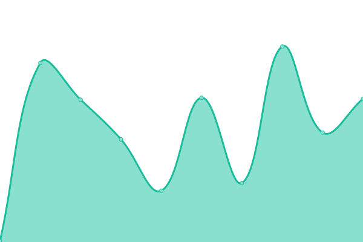

# [📈 Live Status](https://demo.upptime.js.org): <!--live status--> **🟩 All systems operational**

This repository contains the open-source uptime monitor and status page for [Victor Emanuel Cuello](https://emacuello.link), powered by [Upptime](https://github.com/upptime/upptime).

With [Upptime](https://upptime.js.org), you can get your own unlimited and free uptime monitor and status page, powered entirely by a GitHub repository. We use [Issues](https://github.com/emacuello/upptime/issues) as incident reports, [Actions](https://github.com/emacuello/upptime/actions) as uptime monitors, and [Pages](https://demo.upptime.js.org) for the status page.

<!--start: status pages-->
<!-- This summary is generated by Upptime (https://github.com/upptime/upptime) -->
<!-- Do not edit this manually, your changes will be overwritten -->
<!-- prettier-ignore -->
| URL | Status | History | Response Time | Uptime |
| --- | ------ | ------- | ------------- | ------ |
|  [Youdrive](https://youdrive.vercel.app/) | 🟩 Up | [youdrive.yml](https://github.com/emacuello/upptime/commits/HEAD/history/youdrive.yml) | 

 204ms
     
 | 

<a href="https://demo.upptime.js.org/history/youdrive">100.00%</a>
    

|  [Emax-Peluquería](https://emaxpeluqueria.vercel.app/) | 🟩 Up | [emax-peluqueria.yml](https://github.com/emacuello/upptime/commits/HEAD/history/emax-peluqueria.yml) | 

 235ms
     
 | 

<a href="https://demo.upptime.js.org/history/emax-peluqueria">100.00%</a>
    

|  [Hacker News](https://news.ycombinator.com) | 🟩 Up | [hacker-news.yml](https://github.com/emacuello/upptime/commits/HEAD/history/hacker-news.yml) | 

 421ms
     
 | 

<a href="https://demo.upptime.js.org/history/hacker-news">100.00%</a>
    

|  [Emacommerce API](https://emacommerce.vercel.app/api) | 🟩 Up | [emacommerce-api.yml](https://github.com/emacuello/upptime/commits/HEAD/history/emacommerce-api.yml) | 

 3755ms
     
 | 

<a href="https://demo.upptime.js.org/history/emacommerce-api">100.00%</a>
    

|  [Youdrive API](https://app.api-youdrive.duckdns.org/api) | 🟩 Up | [youdrive-api.yml](https://github.com/emacuello/upptime/commits/HEAD/history/youdrive-api.yml) | 

 5102ms
     
 | 

<a href="https://demo.upptime.js.org/history/youdrive-api">100.00%</a>
    

<!--end: status pages-->

[**Visit our status website →**](https://demo.upptime.js.org)

## 📄 License

- Powered by: [Upptime](https://github.com/upptime/upptime)
- Code: [MIT](./LICENSE) © [Anand Chowdhary](https://anandchowdhary.com), supported by [Pabio](https://pabio.com)
- Data in the `./history` directory: [Open Database License](https://opendatacommons.org/licenses/odbl/1-0/)
